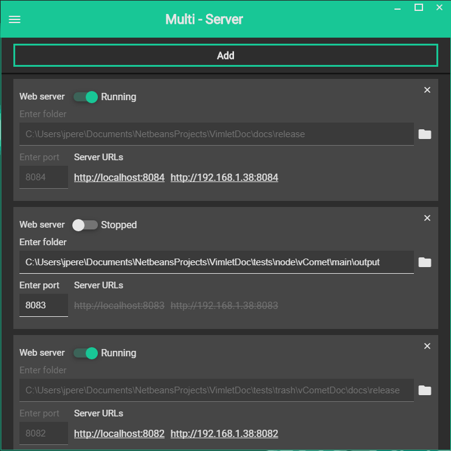

## MultiServer

A fast local server which allows you to open several servers from local folders.



## Features

* Easy to use.
* Run server from local folders.
* As many servers as you want.
* Network access.
* File sharing at the local network.


## Disclaimer

This project is still in beta:

* Frameworks are not minified.
* Commented code here and there.

## Installation

1. Clone the project.
2. ´npm run build´

**Outdated**
1. Direct download:

    Download from /release:

- [multi-server-0.0.1.zip](https://github.com/jesusvimlet/multiserver/raw/master/release/multi-server-0.0.1.zip) for linux.
- [MultiServer-0.0.1-win.zip](https://github.com/jesusvimlet/multiserver/raw/master/release/MultiServer-0.0.1-win.zip) for windows.
- Mac version is not released but you are free to clone the project and use electron-builder to bake it.

2. NPM:

    
```npm i multi-server-installer -g```

Run 

```multiserver i```

 wherever you want to have it installed. You can also specify installation folder.


## Usage

Run the application and add as many servers as you wish.

## LICENSE

Developed under MIT license.